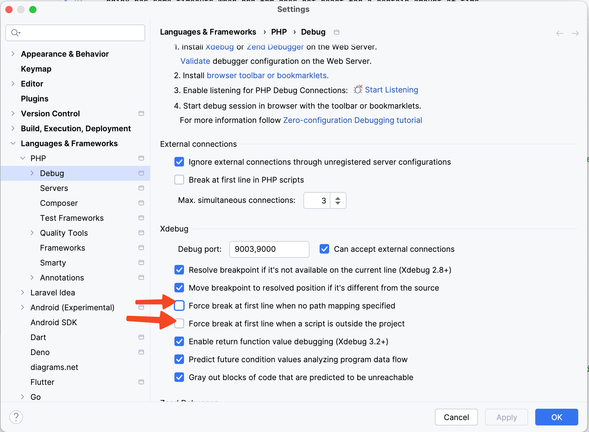

# `drydock xdebug myContainer` - run Xdebug step debugger in a running PHP container

## Background

[Xdebug](https://xdebug.org) is the standard PHP debugger (amongst other things) with great PHPStorm/IntelliJ
IDE integration. Right now (as explained in [drydock spx](spx.md)), we cannot include Xdebug in our Docker images,
because we want to use the same images for dev and prod; and xdebug comes with a performance penalty.

**`drydock xdebug` temporarily runs Xdebug in a running PHP container.**

## Prerequisites

- In IntelliJ/PHPStorm you need to enable `Run -> Start Listening for PHP Debug Connections`.

## Usage

```bash
drydock xdebug [container-name]
drydock xdebug [docker-compose-name]
# for Neos/Flow applications, read the details below!
```

Convenience: You can either specify a container name, or also a `docker-compose` service name if you run this in a
folder with a `docker-compose.yml` file inside).

## Usage with Neos / Flow

tl;dr:

1. Mount `Data/` between host and container
2. use `xdebug_break()` to set breakpoints

Full details below:

**Mount `Data/` between host and container**

All PHP files where you want to set breakpoints need to be mounted/synced between Docker host and container. For
Neos/Flow applications, you NEED to mount:

- `Data` (because of transpiled PHP code files in `Data/Temporary/....`)
- `Packages` in order to set breakpoints easily.

This comes with some performance hit (many mounted files make the system a bit slower), BUT it seems manageable
on Apple Silicon and modern Docker for Mac.

As an example, you need the following docker-compose setup:

```yaml
services:
  #####
  # Neos CMS (php-fpm)
  #####
  neos:
    build:
      context: .
      dockerfile: ./deployment/local-dev/neos/Dockerfile

    volumes:
      - ./app/DistributionPackages/:/app/DistributionPackages/

      # !!!!!!!!!!
      # FOR DEBUGGING, the following two lines are crucial
      - ./app/Data/:/app/Data/
      - ./app/Packages/:/app/Packages/
      # !!!!!!!!!!

      # ... other mounts as you need them
```

Restart the container via `docker compose up -d` after modifying the `docker-compose.yml`. We'd like to get rid of this
restart, but we did not manage to do this yet.

**Use `xdebug_break()` to set breakpoints**

Because the code which is executed resides somewhere in `Data/Temporary`, you would need to set breakpoint via the IDE there.

It is recommended to set breakpoints via the `xdebug_break()` function in code -> as then the IDE will open in the correct
location and file in `Data/Temporary`.

## Debugging Hints

### Gateway Timeout in nginx / Caddy / ...

Normally, we have a setup like this:

```
┌──────────────┐      ┌───────────┐
│nginx / Caddy │      │  php-fpm  │
│reverse proxy │─────▶│           │
└──────────────┘      └───────────┘
```

nginx has some timeouts when php-fpm does not react for a certain amount of time.
If we break at a breakpoint for a long time, we will definitely see the 504 gateway timeout in nginx.



## Help Text

```
drydock xdebug [flags] SERVICE-OR-CONTAINER

Run Xdebug https://xdebug.org in the given PHP Container, and reloads
the PHP Process such that the debugger is enabled.

Options:
      --debug-image          What debugger docker image to use for executing nsenter (and optionally the NFS webdav server).
                             By default, nicolaka/netshoot is used

Examples

Run Xdebug in a running PHP container
	drydock xdebug myContainer

Run Xdebug in a running docker-compose service
	drydock xdebug my-docker-compose-service

Run Xdebug a Neos/Flow Application
	drydock xdebug my-docker-compose-service --mount=app/Data/Temporary,Packages

Background:

    This command installs the Xdebug PHP extension into an existing Docker container, even if the container is locked
    down to a non-root user. Additionally, we reload the PHP process by using kill -USR2.

    This command is using nsenter wrapped in a privileged docker container to install the PHP extension
    inside a running container as root.
```
